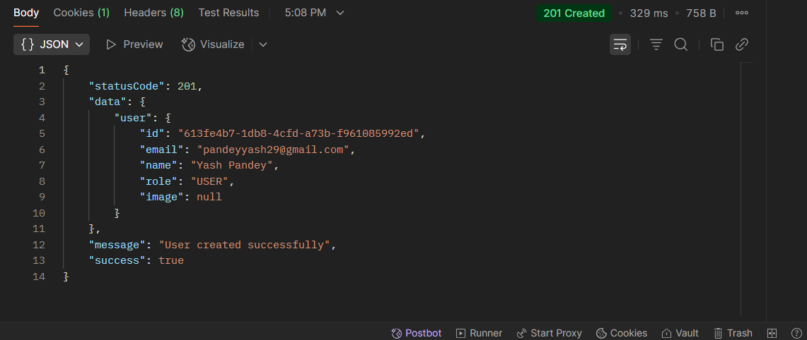
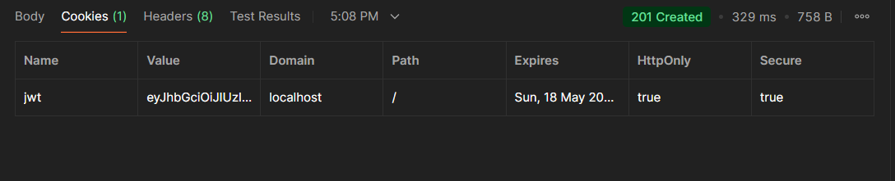
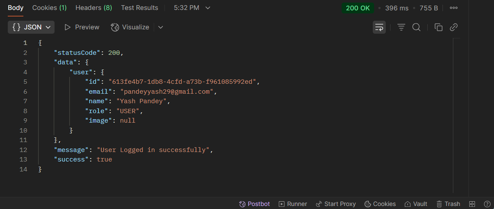
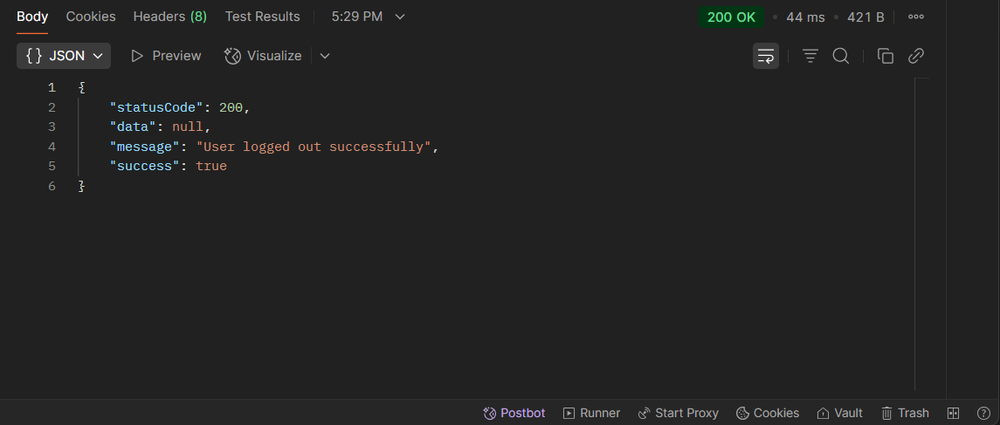
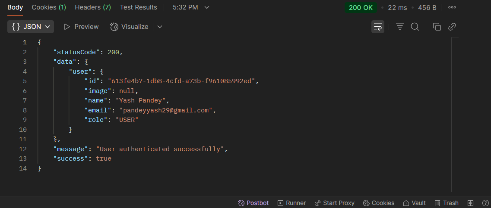

# 🖥️ CodeVantage - Authorization Routes

This document explains the four core authorization routes of the **CodeVantage** full-stack project, focusing on **Signup**, **Login**, **Logout**, and **Check** functionalities.

These routes are crucial for handling user authentication and authorization.

---

## 1. **Signup** 📝 ✍️

- **Method:** `POST`
- **Endpoint:** `/api/v1/auth/register`
- **Description:**
  Allows a new user to register by providing a name, email, and password. If successful, the user is created and a JWT token is generated for future authentication.

### Request Body (JSON):

```json
{
  "name": "Yash Pandey",
  "email": "pandeyyash041@gmail.com",
  "password": "temp1234"
}
```

#### ✅ Successful Signup Response

## 

#### 🍪 Cookies in Postman

## 

## 2. **Login**

- **Method:** `POST`
- **Endpoint:** `/api/v1/auth/login`
- **Description:**
  Allows an existing user to log in by providing their email and password. On successful login, a JWT token is issued for authentication in subsequent requests.

### Request Body (JSON):

```json
{
  "email": "pandeyyash041@gmail.com",
  "password": "temp1234"
}
```

#### ✅ Successful Login Response

## 

#### 🍪 Cookies in Postman

## 

## 3. **Logout** (User Must Be Logged In)

- **Method:** `POST`
- **Endpoint:** `/api/v1/auth/logout`
- **Description:**
  Logs out the currently authenticated user by removing the JWT token. This will invalidate the session on the server side.

#### ✅ Successful Logout Response

## 

## 4. **Check** (User Must Be Logged In)

- **Method:** `GET`
- **Endpoint:** `/api/v1/auth/check`
- **Description:**
  This route checks if the user is authenticated. The user must provide a valid JWT token to access this endpoint. If authenticated, user details are returned; otherwise, a 401 Unauthorized error is returned.

#### ✅ Successful Check User Response

## 

## Conclusion

These routes form the backbone of user authentication in the **CodeVantage** project, enabling users to sign up, log in, log out, and verify their authentication status.

Feel free to integrate these routes with your front-end or postman testing environment!
